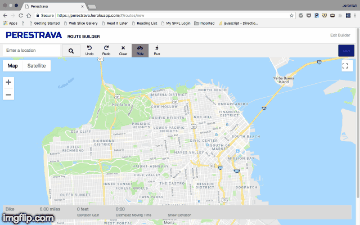

# Perestrava

[Perestrava live site](https://perestrava.herokuapp.com/#/)

Perestrava is a Web app for cyclists and runners that lets users create and store
their riding and running routes using an interactive map. It is modeled after
the Web version of Strava.

Perestrava is built on a Ruby on Rails back end, with a PostgreSQL database and a
React/Redux front end. The first version of this site was built as a project with
a deadline of ten days. More features will be added, and the current features
will be deepened and extended in the future.

## Features

* Secure frontend and backend user authentication using BCrypt
* Interactive route map where users can create and save routes
* Route index page, showing all a user's routes

### Route builder



The route builder uses the Google Maps API to render a map, allow the user to
place markers on the map, and calculate distance, elevation gain, and estimated
moving time. The user can undo the placement of markers, redo the placement of
markers, clear all the markers, and undo the clearing of markers. Under the
statistics bar is an elevation profile panel that can toggle from hidden to
shown. The user can also choose whether the route is a bicycling or running
route, and the statistics bar will update based on this preference. Once at least
two markers have been placed, the user can choose to save the route, entering
a name and description of the route.

A user's saved routes are displayed on an index page, again by making calls to
Google Maps with methods from the Google Maps API. The starting and finishing
markers are saved in a string in the database, and are shown on the index page's
maps of each route.

#### Handling a render dependent on change of state

In route_creator_map.jsx, the function calculateAndDisplayRoute handles the requests
to Google Maps, calculating and displaying the route. The elevation and statistics
are recalculated here as well, via calls within calculateAndDisplayRoute. This became
a problem when writing the function handleWorkoutTypeToggle, which resets the workout
type in the component's state. handleWorkoutType also calls calculateAndDisplayRoute,
but because setState is asynchronous, it doesn't run until after handleWorkoutType has
finished running. This means that calculateAndDisplayRoute did not have access to the
new state, and thus did not re-render the route and statistics unless the toggle
button was clicked twice. This was solved by making calculateAndDisplayRoute a
callback to the call of setState:

```javascript
handleWorkoutTypeToggle(routeType) {
  this.setState({
    routeType: routeType},
    () => this.calculateAndDisplayRoute(this.DirectionsService, this.directionsDisplay)
  );
  let rideButton = document.getElementById('ride-button');
  let runButton = document.getElementById('run-button');
...
}
```

## Projected features

* Individual show pages for each route, reached by clicking on route on the index page
* Editing and deletion of saved routes
* Draggable markers in the Route Builder
* Manual entry form for workouts, either attached to specific routes or not
* Viewing, editing, and deletion of workouts
* Scrolling workout feed on a user's home page ("Dashboard")
* Calculated workout statistics on a user's home page
* Specific timeframes for statistics
