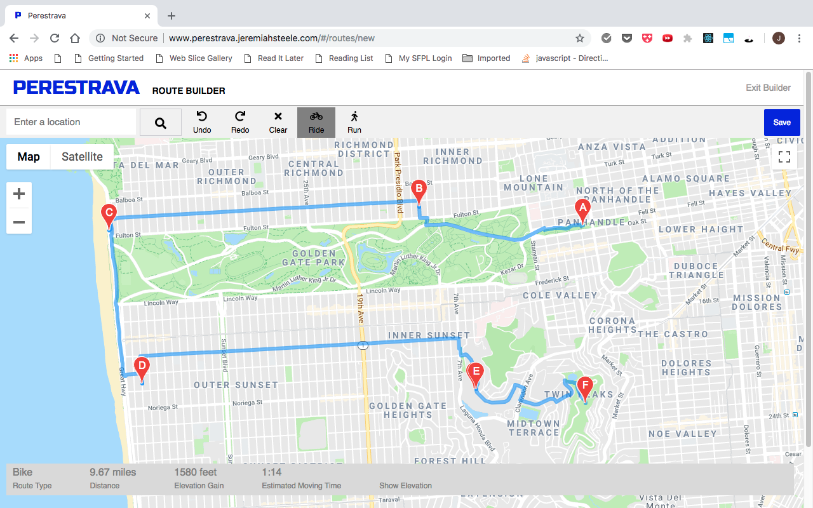
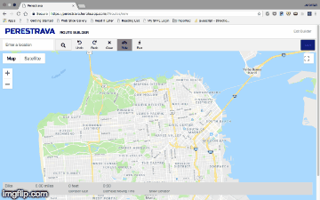
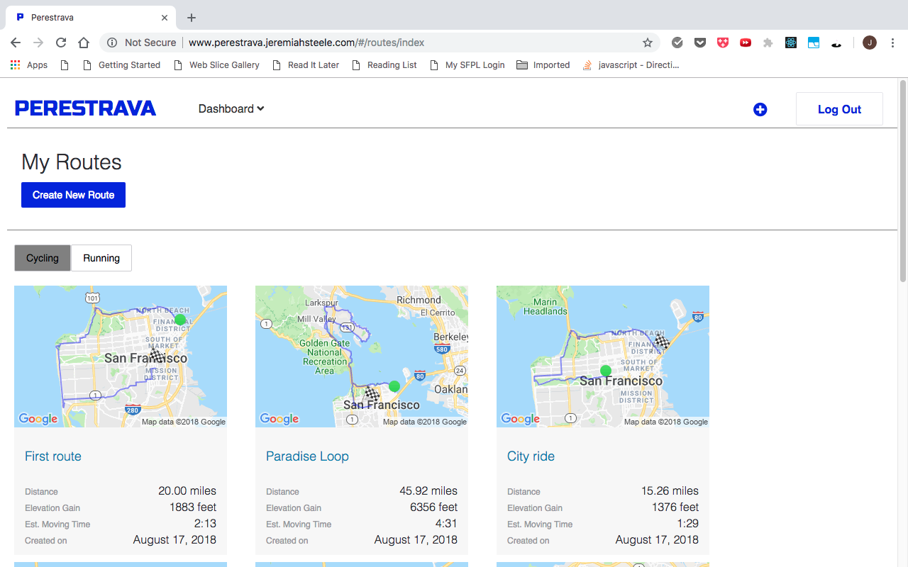

# Perestrava

[Perestrava live site](https://perestrava.herokuapp.com/#/)

Perestrava is a Web app for cyclists and runners that lets users create and store
their riding and running routes using an interactive map. It is modeled after
the Web version of Strava.



Perestrava is built on a Ruby on Rails back end, with a PostgreSQL database and a
React/Redux front end. The first version of this site was built as a project with
a deadline of ten days. More features will be added, and the current features
will be deepened and extended in the future.

## Features

* Secure frontend and backend user authentication using BCrypt
* Interactive route map where users can create and save routes
* Route index page, showing all a user's routes
* Route show pages for each invidual route, accessible from the index page

## Technologies 

* Ruby on Rails back end 
* React/Redux front end 
* Google Maps API (map placement and marker placement)
* Google Maps Directions Service API (route calculation)
* Google Maps Elevation API (elevation calculation)
* Google Visualization API (elevation chart)

### Route builder



The route builder uses the Google Maps API to render a map, allow the user to
place markers on the map, and calculate distance, elevation gain, and estimated
moving time. The user can undo the placement of markers, redo the placement of
markers, clear all the markers, and undo the clearing of markers. Under the
statistics bar is an elevation profile panel that can toggle from hidden to
shown. The user can also choose whether the route is a bicycling or running
route, and the statistics bar will update based on this preference. Once at least
two markers have been placed, the user can choose to save the route, entering
a name and description of the route.

A user's saved routes are displayed on an index page, again by making calls to
Google Maps with methods from the Google Maps API. The starting and finishing
markers are saved in a string in the database, and are shown on the index page's
maps of each route. Clicking on a route on the index page takes the user to a show 
page for the route, with a larger map and display of route statistics.



#### Handling a render dependent on change of state

In `route_creator_map.jsx`, the function `calculateAndDisplayRoute` handles the requests
to Google Maps, calculating and displaying the route. The elevation and statistics
are recalculated here as well, via calls within `calculateAndDisplayRoute`. This became
a problem when writing the function `handleWorkoutTypeToggle`, which resets the workout
type in the component's state. `handleWorkoutTypeToggle` also calls `calculateAndDisplayRoute`,
but because `setState` is asynchronous, it doesn't run until after `handleWorkoutTypeToggle` has
finished running. This means that `calculateAndDisplayRoute` did not have access to the
new state, and thus did not re-render the route and statistics unless the toggle
button was clicked twice. This was solved by making `calculateAndDisplayRoute` a
callback to the call of `setState`:

```javascript
  handleWorkoutTypeToggle(routeType) {
    this.setState({
      routeType: routeType},
      () => this.calculateAndDisplayRoute(this.DirectionsService, this.directionsDisplay)
    );
    let rideButton = document.getElementById('ride-button');
    let runButton = document.getElementById('run-button');
    rideButton.classList.toggle("active");
    runButton.classList.toggle("active");
  }
```
#### Storing placed markers for map rendering and elevation chart 

Each time the collection of placed markers is altered, `calculateAndDisplayRoute` is called. This function 
processes `this.markers`, and creates two arrays of position data, `path` and `positions`. `path` is for the elevation calculation, and positions is for the route calculation. The Google Maps API methods behind these calculations require the location data in slightly different form, so both arrays are necessary. The route calculation uses the Directions API, whose methods require route origin and destination to be 
specified. The `this.state.markerString` variable, which is used for calculation of the route polyline when it is displayed on the index and show pages, is also updated by this function.


```javascript 
    let positions = [];
    let path = [];
    this.markers.forEach(marker => {
      let location = { location: { lat: marker.position.lat(), lng: marker.position.lng() } };
      positions.push(location);

      path.push({lat: marker.position.lat(), lng: marker.position.lng()});

      if (this.markers.length === 1) {
        path.push({lat: marker.position.lat(), lng: marker.position.lng()});
        directionsDisplay.setOptions({ preserveViewport: true });
      } else {
        directionsDisplay.setOptions({ preserveViewport: false});
      }

    });

    let origin = {lat: positions[0].location.lat, lng: positions[0].location.lng};
    let destination = {lat: positions[positions.length - 1].location.lat, lng: positions[positions.length -1].location.lng};

    this.state.markerString = [origin.lat, origin.lng, destination.lat, destination.lng].join(",");
```

#### Allowing undo, redo and clear of marker placement 

A key function of the route creator map is carried out by the undo, redo, and clear buttons. 
These allow the user to correct errors in marker placement, or start over before saving the route. 
When a user places a marker, it is added to the `this.markers` array. When it is removed by clicking the undo button, 
it is placed in a `removedMarkers` array, so that it is not lost. The redo button moves the marker back to the 
first array. The clear button puts all the markers in the `removedMarkers` array. The undo button has 
more than one function, depending on the stage of route creation: it can remove a single marker, or it can replace all markers after the clear button has been clicked. Here is the logic for the undo button: 

```javascript 
  undo() {
    if (this.markers.length > 0) {
      let lastMarker = this.markers.pop();
      lastMarker.setMap(null);
      this.removedMarkers.push(lastMarker);
      this.directionsDisplay.set('directions', null);
      this.setState({
        length: 0,
        duration: 0
      });
      this.calculateAndDisplayRoute(this.directionsService, this.directionsDisplay);
    }

    if ( this.markers.length === 0 && this.removedMarkers.length > 0) {
      if (this.removedMarkers[this.removedMarkers.length - 1] === null) {
        this.removedMarkers.pop();
        let nextMarker = this.removedMarkers[this.removedMarkers.length - 1];
        while (nextMarker !== null && this.removedMarkers.length > 1) {
          nextMarker = this.removedMarkers[this.removedMarkers.length - 1];
          this.markers.push(nextMarker);
          this.removedMarkers.pop();
          nextMarker = this.removedMarkers[this.removedMarkers.length - 1];
          if (this.removedMarkers.length === 1 && nextMarker === null) {
            this.removedMarkers = [];
          }
        }
      }
      this.setState({
        length: 0,
        duration: 0
      });
      this.markers.forEach(marker => {
        marker.setMap(this.map);
      });
      this.calculateAndDisplayRoute(this.directionsService, this.directionsDisplay);
    }

  }
```

At each step of this process, whenever a marker is placed or removed, the statistics bar is 
updated, and the elevation chart is recalculated. 

## Projected features

* Editing and deletion of saved routes
* Draggable markers in the Route Builder
* Manual entry form for workouts, either attached to specific routes or not
* Viewing, editing, and deletion of workouts
* Scrolling workout feed on a user's home page ("Dashboard")
* Calculated workout statistics on a user's home page
* Specific timeframes for statistics
